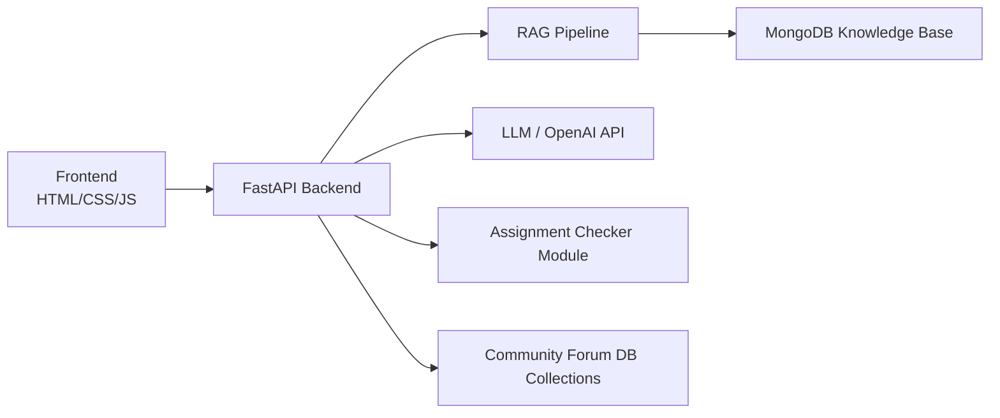

# SmartAssist – Campus Services Assistant

SmartAssist is an AI-powered campus assistant combining **Dual-Mode Chatbot**, **Assignment Checker**, and a **Community Forum** to support students at Texas A&M University–Corpus Christi.  
It integrates LLMs with a custom RAG pipeline, MongoDB, FastAPI backend, and a responsive UI.

---

## 🌐 Live Demo
🔗 https://stejani-smart-assist.hf.space/

---

# 🚀 Key Features

## 1. Dual-Mode Chatbot
### **Uni Mode**
- Answers campus FAQs using RAG  
- Provides professor info, office locations, building details  
- Ticket creation, navigation help, event queries  

### **My Learning Mode**
- Virtual academic assistant  
- Creates quizzes, flashcards, explanations  
- Helps understand topics with fresh examples  

---

## 2. Assignment Checker
- Upload assignments in PDF/DOCX/TXT  
- Provides structural & conceptual feedback  
- Highlights missing sections, clarity issues, and grammar  
- Uses LLM-powered formative evaluation  

---

## 3. Community Forum
- Post questions  
- Peer-to-peer discussions  
- Topic-based filtering  
- Stores posts in MongoDB  

---

## 4. Additional Features
- Ticketing system  
- Appointment scheduling  
- Full knowledge base search  
- Navigation and building lookup  
- Admin portal for KB, faculty, events  
- Analytics support  

---

# 🖥️ System Requirements

## 🔧 Hardware Requirements

### **Minimum Requirements**
- Processor: Dual-core CPU (2.0 GHz or higher)
- Memory: 8 GB RAM
- Storage: 50 GB available disk space
- Network: Stable internet connection (10 Mbps minimum)

### **Recommended Requirements**
- Processor: Quad-core CPU (3.0 GHz or higher)
- Memory: 16 GB RAM or more
- Storage: 100 GB SSD storage
- Network: High-speed internet (50+ Mbps)

---

## 💿 Software Requirements

### **Supported Operating Systems**
- Windows 10/11 (64-bit)
- macOS Catalina (10.15) or later
- Linux: Ubuntu 20.04 LTS+, CentOS 8+

### **Required Software**
- Python 3.10+
- Git (latest stable)
- MongoDB 5.0+ (local or cloud)
- Web Browser: Chrome 90+, Firefox 88+, Safari 14+, Edge 90+

### **Development Tools**
- VS Code / PyCharm / any IDE
- Docker (for containerized deployment)
- Postman (optional for API testing)

---

# 🧠 System Architecture



---

# 📁 Project Structure

```
smartassist/
│── main.py               
│── rag_pipeline.py       
│── extract_web_content_to_mongo.py
│── templates/            
│── static/               
│── uploads/              
│── js/                   
│── db/                   
│── requirements.txt
│── docker-compose.yml
│── Dockerfile
```

---

# ⚙️ Installation & Setup

## 1. Clone Repository
```bash
git clone https://github.com/smit-tejani/SmartAssist-Campus-Services-Assistant.git
cd SmartAssist-Campus-Services-Assistant
```

## 2. Run the project using Docker
```bash
docker-compose up --build
```

➡️ **Wait for the project to fully start up.**  
This may take a few minutes during the first run (model loading, dependency installation, database initialization).

## 3. Access the Application  
Once the project is running successfully, open the application in your browser using:

👉 **http://localhost:7860**  
*(If your terminal shows a different port, use that instead.)*

---

# ☁️ Deployment (HuggingFace Spaces)
- Uses Docker setup  
- Exposes FastAPI backend  
- Serves frontend via static hosting  

---

# 📄 License
Academic project for TAMU-CC.  
Open for educational and research use.

---

# 👥 Authors
This project was developed as part of the **CodeGems SmartAssist Team** for the 2025 academic term.
